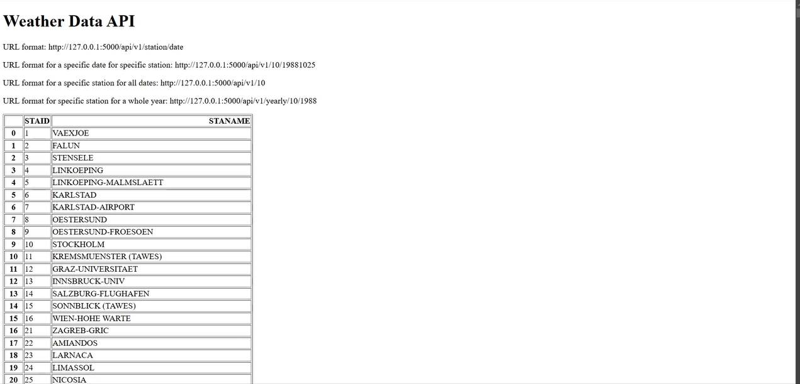

# 🌦️ Weather Data API

A **Flask**-based API that provides access to historical weather data. This API allows users to retrieve temperature data for specific weather stations, dates, or entire years. It uses **Pandas** for data manipulation and serves data in JSON format.

---

## 🛠️ Features

- **Station Data**: Retrieve a list of weather stations.
- **Temperature by Date**: Fetch temperature data for a specific station and date.
- **All Data for a Station**: Retrieve all historical temperature data for a specific station.
- **Yearly Data**: Get temperature data for a specific station and year.

---

## 🚦 How to Use

1. Install the required dependencies (`Flask` and `pandas`).
2. Run the Flask application using the provided script.
3. Use the following endpoints to interact with the API:
   - `/`: Home page with a list of weather stations.
   - `/api/v1/<station>/<date>`: Get temperature for a specific station and date.
   - `/api/v1/<station>`: Get all temperature data for a specific station.
   - `/api/v1/yearly/<station>/<year>`: Get temperature data for a specific station and year.

---

## 📸 Screenshots

---

## 🎥 Demo

---

## 📬 Contact

Feel free to explore the project and share your feedback. For any inquiries, suggestions, or contributions, reach out to me at **sathiyanarayanan.s1698@gmail.com**.
